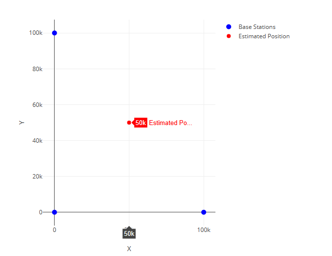
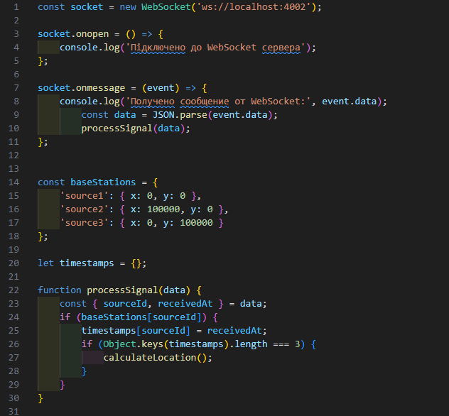
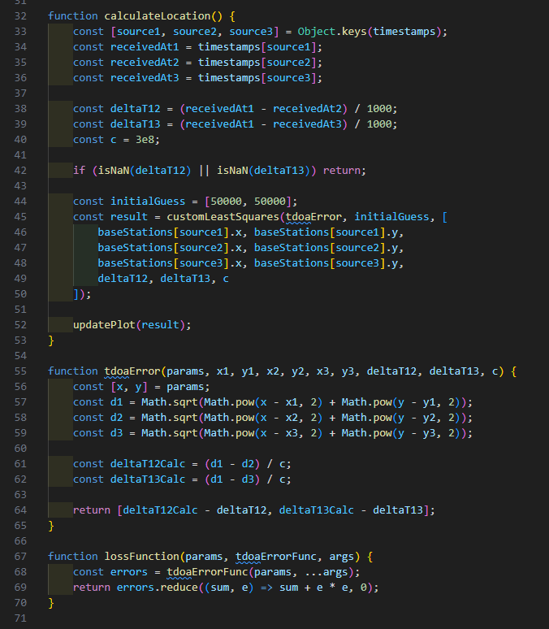
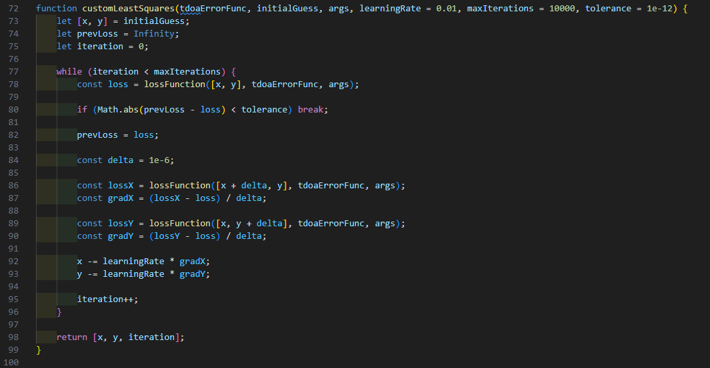
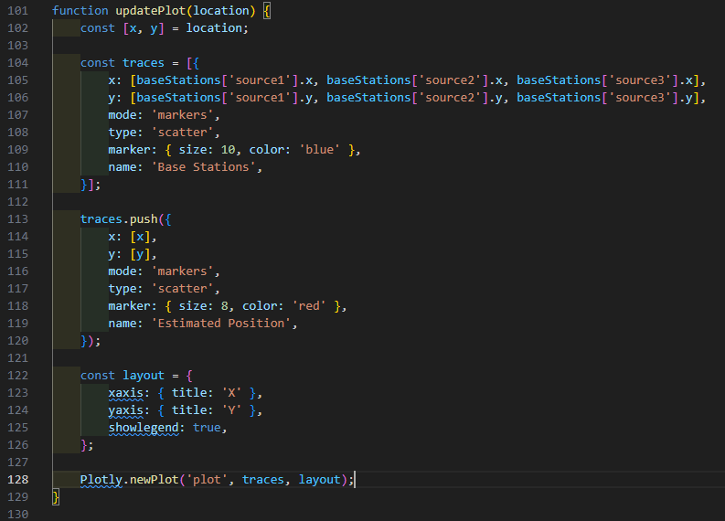
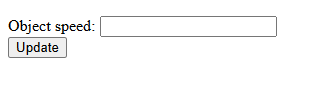
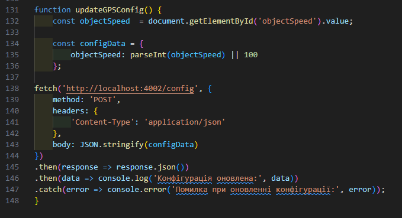

# LORAN
Емулятор вимірювальної частини LORAN надається у вигляді Docker image під назвою iperekrestov/university/loran-emulation-service. Щоб запустити емулятор, виконайте наступні кроки:  
1. Завантажте Docker image з Docker Hub:  
docker pull iperekrestov/university:loran-emulation-service  
2. Запустіть Docker контейнер, використовуючи наступну команду:  
docker run --name loran-emulator -p 4002:4000 iperekrestov/university:loran-emulation-service  
Для зчитування даних з емулятора необхідно підключитися до нього через WebSocket:  
wscat -c ws://localhost:4002  

Веб-додаток підключається до WebSocket сервера та зчитує дані про часи отримання сигналів базовими станціями. Обробляє дані отримані через вебсокет і відображає  положення об'єкта і базових станцій на графіку.  
  
    
  
  
  
  
Можливість зміни параметрів вимірювальної частини радара за допомогою API запитів.  
  
  
